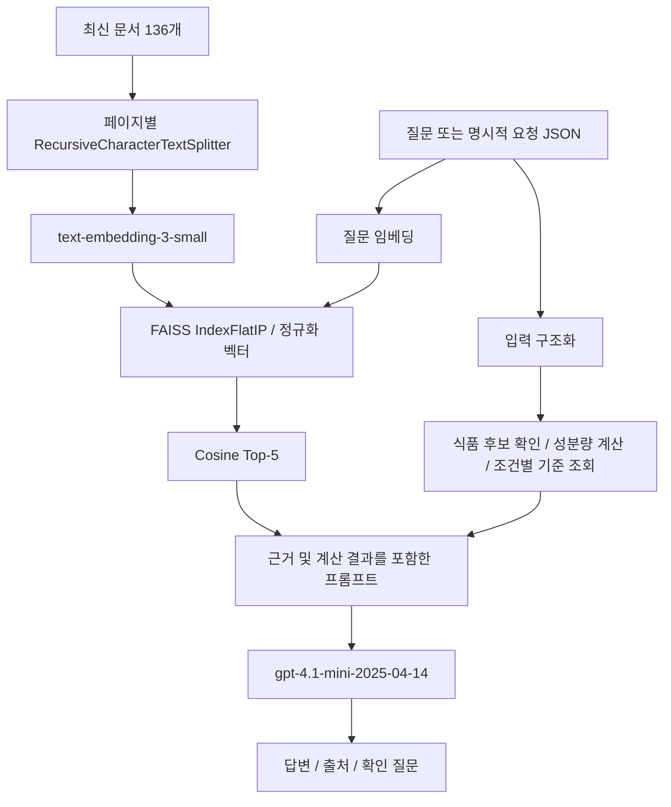
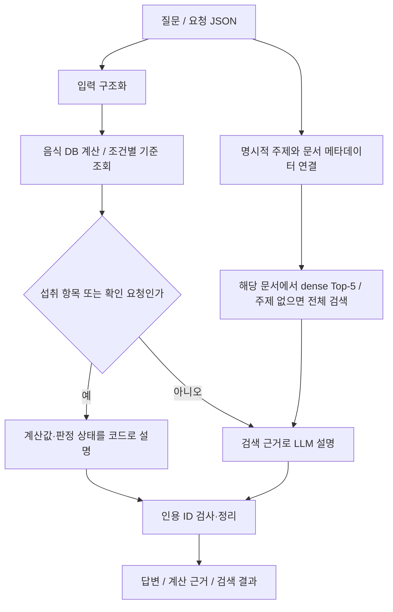

> 보존용 개발 이력입니다. 아래 ‘최종’·테스트 수·상대 경로는 당시 상태이며 현재 제출본이 아닙니다. 현재 결과는 저장소의 results/design.md와 results/evaluation.md를 참고하세요.

# 과유불급 RAG 설계 — Baseline v1

## 문제와 사용자

음식·커피·보충제 섭취량을 기록하는 일반 사용자가, 해당 섭취량의 성분을 계산하고 공식 자료의 조건별 기준과 비교해 이해하도록 돕는다. 한 번의 섭취를 하루 전체 섭취와 동일시하지 않으며, 의료 진단·복용 변경은 다루지 않는다.

## 데이터 범위

최신 정제 문서 136개만 dense retrieval에 사용한다. 과거 문서 63개와 메타데이터 전용 자료는 검색 근거에 넣지 않는다. 공식 기관·학회·연구 자료가 포함되며, 출처 링크는 `data/source_manifest.json`에 보존한다.

음식 19,617건과 영양성분 134열은 SQLite에서 조회한다. 값이 비어 있으면 미확보로 유지한다. 100g 기준 13,877건과 100ml 기준 5,740건을 섞어 계산하지 않는다. 동일 음식명이 여러 출처에 있으면 식품코드 선택이 필요하다.

KDRI 2025 정오표 반영 국문 요약본의 검증한 기준표를 구조화했다. 4,641개 행 중 숫자 기준 2,338개, 상속 2개, 표에 미설정된 행 2,301개이다. 57개 영양소·형태를 구분한다. 나이·성별·임신·수유 조건으로 조회하며 기준표 출처 문서·물리 PDF 페이지·셀 좌표를 보존한다. 카페인은 KDRI UL과 구분한 식약처 권고 3개를 별도 규칙으로 사용한다.

## Baseline 구조

교재의 Loader → Splitter → Embedding → Vector Store → Retriever → Prompt → LLM 흐름을 구현한다. 구조화 DB는 수치의 출처·단위·계산을 일관되게 유지하기 위한 공통 도구이며, 향후 검색 개선 실험에서도 동일하게 유지한다.

- 1,500자 청크, 200자 겹침. PDF는 페이지 경계를 넘겨 분할하지 않는다.
- 현재 8,308개 청크. 임베딩 입력 본문 합계 8,138,481자(겹침 포함).
- 벡터 정규화 후 내적으로 cosine similarity를 계산하고 Top-5를 반환한다.
- 임베딩은 본문·모델 해시별 32개 배치로 캐시한다. 문서·모델 해시가 인덱스와 다르면 재구축을 요구한다.
- 기본 모델은 비교를 위해 날짜가 고정된 snapshot으로 지정했다. `.env`로 변경할 수 있다.
- 자연어 입력은 Structured Outputs로 스키마화하고, 미명시 정보는 null로 보존하도록 지시한다. 스키마 유효성이 사실 추출 정확성을 보장하지 않으므로 자연어 해석도 평가한다.
- 검색 결과에 source/document/chunk ID, 제목, URL, PDF 페이지, 유사도 점수를 남긴다. 답변의 `[D1]`은 검색 근거, `[T1]`은 계산 근거이다. 인용 ID 검사와 내용의 함의 평가는 별개다.

OpenAI 구현 참조: [임베딩](https://developers.openai.com/api/docs/guides/embeddings), [Structured Outputs](https://developers.openai.com/api/docs/guides/structured-outputs), [모델 snapshot](https://developers.openai.com/api/docs/models/gpt-4.1-mini).

## 계산 및 답변 정책

한 항목의 `성분량 × 섭취량/기준량` 또는 `표시 함량 × 개수`를 Decimal로 계산한다. 사용자 제공 라벨 값은 검증한 제조사 DB 값과 구분한다. 제품명만으로 함량을 추정하지 않는다. Baseline에서 여러 항목의 합산 요청은 지원 범위를 설명하고 분리 입력을 요청한다.

RNI·EAR·AI는 충족 참고 기준이며 초과를 과다 섭취로 판정하지 않는다. UL, CDRR, 최대 일일 섭취 권고량을 별개로 표시한다. 보고량이 기준 이하라는 사실만으로 하루 총량이나 개인별 안전을 판정하지 않는다. 비타민 A·E 상한의 형태·급원, 니아신·엽산 형태, 식품 외 마그네슘 등 적용 범위가 불명확하면 비교를 보류한다. IU 변환도 현재 자동 지원하지 않는다.

카페인은 성인 400mg/일, 임신 중 300mg/일, 어린이·청소년 2.5mg/kg/일의 최대 섭취 권고를 비교한다. 대상 범주를 명시적으로 받으며, 어린이·청소년은 체중이 필요하다. 수유 중에는 자동 수치 비교를 보류한다. 원문이 연령 경계를 구체적으로 정의하지 않아 임의 나이 기준으로 대상을 분류하지 않는다. [식약처 자료](https://impfood.mfds.go.kr/CFBCC02F02/getCntntsDetail?cntntsMngId=00005&cntntsSn=278410)

문서가 질문을 뒷받침하지 않으면 근거가 부족하다고 답하고, 섭취량·제품명·인적 조건이 부족하면 확인 질문을 한다. 검색 자료 내 지시문은 지시로 실행하지 않도록 프롬프트를 구성한다. 이 프롬프트의 효과는 향후 실제 생성 평가로 확인해야 한다.

## 평가와 개선 선택

`examples/evaluation_questions.jsonl`의 12개 질문을 고정한다. 정답 출처가 있는 문항은 source ID Recall@5를 기록하고, passage 수준의 적합성과 중복·무관 문서를 검토한다. 근거 없는 질문은 검색 Recall 분모에서 제외한다. 생성은 질문 대응, 계산 정확성, 근거 일치, 확인 질문, 미확보 정보에 대한 단정 여부를 검토한다.

키 입력 창에서 인증 정보를 설정한 뒤 실제 임베딩과 LLM 호출을 수행했다. Baseline 12문항 중 정답 출처가 지정된 8문항의 source Recall@5는 75%였다. 카페인 관련 2문항에서 KR_CAFFEINE이 누락되고 KDRI만 검색됐다. 이 결과를 토대로 질문 집합·모델·계산 도구를 고정하고 아래의 개선 7종과 최종 조합을 비교했다.

생성 단계에서도 한 음식만으로 안전·부족을 판단하거나, 커피 잔당 함량을 추정하는 문제가 확인됐다. 이는 검색 개선만으로 해결됐다고 볼 수 없으며 별도로 확인 질문과 결정적 계산 결과의 준수를 검증해야 한다. 원본 실행 결과와 assistant의 1차 검토는 `results/runs/baseline_01`에 로컬 보관한다. 사용자·전문가 평가는 미완료다.

## 한계와 공개 계획

OCR이 필요한 아스파탐·냉수욕·수중침수 3개 출처, EFSA 수크랄로스 부록 8개, 모든 표·그림 전수 검토는 남아 있다. KDRI 요약 기준표는 검증했지만 전체 문서의 모든 표가 검증됐다는 의미는 아니다. 재수집 없이 현재 자료로 Baseline 평가를 진행하기로 했다.

GitHub에는 코드·합성 예제·테스트·설계/평가 문서·출처 메타데이터를 공개할 수 있도록 구성한다. 원본·정제 본문·DB·임베딩·키·개인 입력/출력은 추적에서 제외한다. 출처별 재배포 조건은 미확정이며 코드 라이선스도 아직 지정하지 않았다. 전체 데이터 수집까지 자동 재현되는 저장소는 아니고, 공개 clone의 설치·계산 흐름은 합성 예제로 재현한다.

## 단독 개선 7종 실험과 최종 선택

이 절은 위 Baseline 설계 이후 수행한 실험을 반영한다. `src/capstone_compare.py`는 실행 진입점이며, `src/experiments.py`는 비교 구현을 담는다. 제출 시 보조 모듈과 기존 DB 조회 스크립트도 함께 포함해야 한다.

| 방법 | Baseline에서 바꾼 요소 | 고정 설정 |
|---|---|---|
| 하이브리드 | 검색 순위 | dense 50 + BM25 50, RRF 상수 60, 최종 5 |
| MMR | 검색 선택 | dense 후보 50, 관련성 가중치 0.7, 최종 5 |
| 재순위화 | 검색 순위 | dense 후보 20, 동일 모델의 관련성 0~4점, 최종 5 |
| 주제 필터 | 검색 범위 | 문서 linked_entities와 명시적 주제 연결; 없으면 전체 dense |
| 문맥 압축 | 생성 입력 | 관련 단락 최대 3개/700자 목표; 긴 문장 보존, 미확보 계산행 제외·출처 참조 |
| 계산·확인 강화 | 섭취 질문의 답변 경로 | Python 계산 결과와 status를 직접 렌더링; 일반 질문은 기존 생성 |
| 인용 검증 | 답변 후처리 | 복합·범위·괄호 인용의 ID 검사와 없는 ID 제거; 사실 내용은 변경하지 않음 |

BM25는 영어/숫자 단어와 한국어 단어·문자 bigram을 사용한다. 별도 형태소 분석기를 설치하지 않는다. 주제 필터는 수집 단계의 entity ID를 사용한다. 한 글자 영양소명은 부분 문자열만으로 분류하지 않고, 커피·카페인 등 일반적인 동의어는 연결한다. 문서에 없는 평가 정답 정보를 검색에 넣지 않는다.

공정한 downstream 비교를 위해 Baseline의 자연어 구조화 결과를 모든 방법에서 재사용한다. 따라서 이 실험은 입력 추출 정확도를 재평가한 결과가 아니다. 질문 파일·코퍼스·모델 해시를 검사하고 결과를 덮어쓰지 않는다. 인용/계산 강화는 변경하지 않는 일반 답변을 원래 결과에서 재사용하여 생성 난수 차이를 줄였다. 나머지 생성은 한 번씩 실행했고 통계적 유의성은 평가하지 않았다.

최종 선택은 **주제 필터 + 계산·확인 강화 + 인용 검증**이다. 주제 필터는 이 개발 질문 집합에서 8/8 출처를 찾았고, 별도 재순위화 LLM 호출이 필요 없다. 압축은 입력량을 줄였지만 카페인 권고 수치를 제거한 회귀가 있어 제외했다. 하이브리드는 디카페인 영어 근거를 놓쳤고 MMR은 카페인 검색 누락을 해결하지 못했다. 상세 결과는 evaluation.md에 기록한다.

이는 검색 개선만으로 생성 오류가 해결됐다는 주장이 아니다. 실제 섭취 수치·판정은 코드로 제한하지만, 일반 설명 질문은 여전히 LLM이 잘못 해석할 수 있다. 최종 평가에서도 상한섭취량에 대한 일반 설명 오류가 남았다. 알려진 질문 12개로 선택한 설정이므로 새로운 음식·음료·비타민, 복합 섭취와 모호한 표현을 포함한 독립 평가가 필요하다.

재순위화는 [OpenAI Structured Outputs](https://developers.openai.com/api/docs/guides/structured-outputs)를 사용한다. 최초 실험에서 후보 목록 형식 검증 실패가 있어 후보 수 제약과 한 차례 재시도를 추가하고, 동일한 보완 설정으로 12문항 전체를 다시 실행했다. 이 변경은 원시 결과와 실행 이력에 남긴다.

## 새 질문으로 확인한 입력·설명 경계

최종 구성을 변경하지 않고 새 자연어 24문항을 평가했다. 기존 비교에서 재사용했던 입력 추출 단계도 이번에는 실제로 실행했다. 질문·기대값은 사전 고정했고 코드 해시 불변을 확인했다. 24개 모두 실행됐지만 assistant 검토 결과 충족 14개, 부분 충족 5개, 실패 5개였다. 세부 내용과 제한은 [evaluation.md](evaluation.md)에 기록했다.

음수 부호 제거, `ug_RAE` 단위 손실, 비섭취 문장의 섭취 기록 생성이 발견됐다. 입력 구조화 뒤에 양수 여부만 검사하면 원문이 양수로 바뀐 오류를 검출할 수 없다. 다음 개선 후보는 원문과 추출값·단위·의도의 대조, 성분과 주장별 근거 검토, UL 미설정 등 계산 상태의 설명 보완이다. 이번 평가에서는 해당 기능을 추가하지 않았다. 현재 인용 검증은 ID 존재만 검사하며 문장 의미의 일치를 보장하지 않는다.

## 채택한 후속 수정 — 원문 입력 검증

위의 새24문항을 회귀 평가셋으로 전환하여 구현을 수정했다. `ExtractedRequest`는 부호·단위를 보존하는 원시 추출 스키마이고, `Request`/`Intake`는 계산에 사용할 검증된 스키마다. 원문의 음수/0은 모델 호출 전에 검사한다. 추출 모델은 원문 증거와 실제 섭취/가정/일반 질문/답변 지시를 구분하며, 코드가 수치·단위·개수·식품코드와 증거 문자열을 원문과 대조한다. 원문에 없는 변환을 조용히 적용하지 않는다. 불일치가 있으면 한 번 재추출하고, 계속 실패하면 `input_issues`로 계산을 보류한다. 복합 단위와 한국어 개수 표기를 지원하며 명시된 청소년 조건을 유지한다.

원문 검증은 한국어 의미 전체의 증명이 아니다. 여러 항목이 들어 있는 문장에서는 값과 항목의 정확한 연결, 조건/부정 표현, 프로필 해석의 추가 검증이 필요하다. 모델이 잘못된 정보를 원문에서 그럴듯하게 연결할 가능성이 남는다. 실제 섭취 입력과 서비스 범위를 구분하는 보수적 가드도 모든 표현을 포괄하지 않는다.

렌더러는 단일 성분의 UL 미설정을 설명하고, 수유 시 개별 확인을 안내하며, 형태가 필요한 성분은 형태·급원 확인을 요청한다. 식품의 다수 미설정 기준 행에 같은 안내를 반복하지 않는다. `daily_complete`가 전달된 경우 문구에 반영하지만 자연어 추출이 이 플래그를 항상 올바르게 설정하는지는 보장하지 않는다.

일반 설명을 개선하려고 근거 후보 확장·원문 단락 선택·LLM 검토도 실험했다. 문서 내용과 같은 문장을 선택해도 의미 검증은 실패할 수 있었고, 검토 모델이 정상 답변을 삭제하는 회귀가 있었다. 따라서 최종 `selected_strategy.json`은 **evidence_review=false**로 유지한다. 실험 구현과 실행 스냅샷은 비교 기록으로 보존한다. 생성 프롬프트를 강화했지만 일반 설명의 사실 오류가 해결된 것으로 간주하지 않는다.

최종 코드는 기존24·처음12·추가8 회귀 평가와 미사용4문항을 각각 실행했다. 결과·실패·채택/제외 근거는 [evaluation.md](evaluation.md), 원문 없는 공개 집계는 [revision_summary.json](revision_summary.json)에 기록한다. 자동 테스트36개와 공개 복사본의34개 통과·2개 skip을 확인했다.

## 제출 버전의 개념 조회와 근사 환산

최종 기본 전략은 기존 주제 필터·계산 렌더러·인용 ID 검사에 `bounded_concepts=true`를 추가한다. `src/knowledge_rules.py`는 평가 문항 ID를 사용하지 않고 개념·요청 형태로 분기한다. `src/knowledge_sources.json`에는 수작업으로 읽고 확인한 근거의 청크 ID·원문 해시·페이지·URL만 저장하며 제3자 본문을 공개 코드에 복제하지 않는다. 실행 시 실제 코퍼스에서 같은 청크와 해시를 확인해야 설명할 수 있다. 누락·변경 시 확인 보류 답변을 반환한다.

지원 개념은 기준 종류, 총당류/첨가당, 여러 급원 카페인, 소금 환산의4종이다. 고정 설명은 검토한 개념 범위를 넘지 않으며 계산은 Decimal 함수가 담당한다. salt_per_sodium=2.5는 KDRI의 근사 대응에서 유도한 식품 표시용 소금 환산량이며 실제 제품의 조성 측정값이나 개인별 권고량이 아니다. 계산 내역은 `calculation.concept_calculation`에 남기고 [T1]을 연결한다. 법적 의무·개인별 건강 판정은 이 근거 범위를 넘어가므로 보류한다.

최종 경로는 서비스 범위 확인 → 실제 섭취 도구 계산/확인 → 해당 개념의 검증된 출처 조회·고정 설명 → 그 외 일반 RAG 생성이다. 개념 경로에서 검색 결과를 선택된 앵커로 바꾸고 무관한 문맥을 생성에 전달하지 않는다. LLM 근거 검토 실험은 계속 비활성화되어 있다. 적용 범위가 작은 수작업 지식 계층이며 일반 생성의 모든 오류를 해결한 구현은 아니다.

제출 시 지정된 진입점/설계/평가3개 파일뿐 아니라 보조 모듈·설정·DB 조회 스크립트도 함께 전달해야 한다. 공개용 묶음은 원문·DB·키를 제외하며 실행 절차와 데모는 `docs/DEMO.md`, `docs/SUBMISSION.md`에 설명한다.
