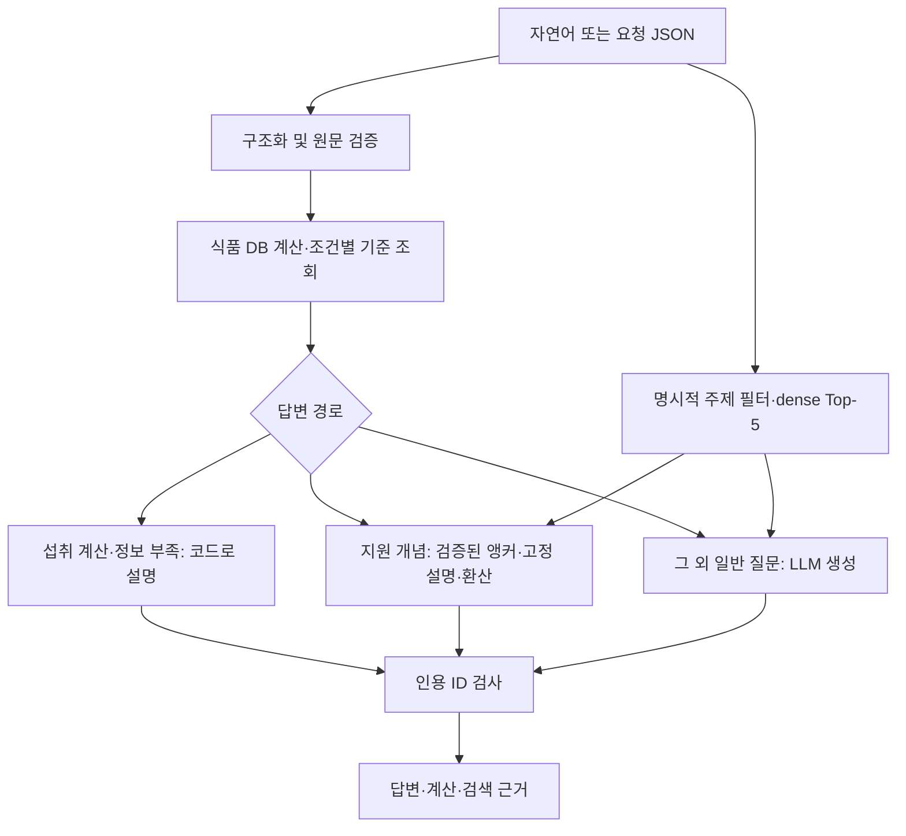

# 과유불급 RAG 설계

2026-10-02. 음식·커피·보충제의 보고 섭취량을 계산하고 공식 자료의 조건별 기준과 함께 설명한다. Baseline 구현 → 동일 질문 비교 → 새 질문에서 오류 발견 → 입력 검증·제한된 개념 설명 보완 → 회귀 검증의 흐름으로 개발했다. 현재 평가 결과와 과거 실험은 평가 문서에서 구분한다.

## 실행 구성과 사용 환경

구현 코드는 `src/capstone_compare.py`, 설계 문서는 `results/design.md`, 평가 기록은 `results/evaluation.md`에 있다. 진입점에 직접 작성한 보조 모듈·선택 설정·의존 패키지 목록을 포함했다. 세 파일만 별도 폴더에 복사해도 아래 명령은 **Python 표준 라이브러리만으로** 동작한다. 폴더 계층을 유지하거나 세 파일을 한 폴더에 두는 방식 모두 지원한다.

```bash
python src/capstone_compare.py --help
python src/capstone_compare.py --demo
python src/capstone_compare.py --requirements
```

한 폴더에 세 파일을 두었다면 `src/`를 빼고 실행한다. `--demo`는 가상음식 200g의 에너지 160kcal·나트륨 60mg과 미확보 값 보존을 확인하는 오프라인 계산이다. 실제 영양 기준이나 검색·생성을 재현하는 데모는 아니다.

**전체 RAG에는 외부 패키지, 별도 코퍼스/DB, 임베딩 인덱스 및 API 키가 필요하다.** 이 외부 자원을 세 파일에 포함했다는 뜻은 아니다. 로컬 보조 모듈이 없으면 내장 소스를 해시 검증 후 임시 폴더에 복원하고 종료 시 정리한다. 전체 저장소에서는 읽기 쉬운 개별 모듈을 사용하며 생성 스크립트가 내장 소스와의 일치를 검사한다.

```bash
python src/capstone_compare.py --requirements > requirements.txt
python -m pip install -r requirements.txt
# OPENAI_API_KEY는 환경변수 또는 로컬 .env로 설정
export RAG_DATA_DIR=/path/to/prepared
export RAG_CACHE_DIR=/path/to/index
python src/capstone_compare.py build
python src/capstone_compare.py ask --question '커피 세 잔 마셨는데 카페인 과다야?'
```

위 명령의 경로는 사용자가 준비한 자료 경로로 바꾼다. `build`는 유료 임베딩 API를 사용한다. 이미 검증된 인덱스가 있으면 생략한다. 데이터 파일 형식과 준비 절차는 [공개 데이터 안내](https://github.com/dfklsna/gwayubulgeup-rag-capstone/blob/main/data/README.md)에 있다. 전체 수집 자료를 자동 복원하는 배포는 아니다. 세 파일에는 키·원문·실제 DB·임베딩을 넣지 않는다.

## 데이터와 기능 범위

| 자원 | 규모와 사용 |
|---|---|
| 최신 정제 문서 | 136개, 8,308청크; 과거 문서 63개는 기본 검색 제외 |
| 음식 DB | 19,617건·성분 134열; 100g 기준 13,877건 / 100ml 기준 5,740건 |
| KDRI 2025 기준 | 4,641행: 숫자 2,338 / 상속 2 / 미설정 2,301; 영양소·형태 57종 |
| 카페인 규칙 | 대상별 식약처 최대 일일 섭취 권고 3개; KDRI UL과 별도 취급 |

음식은 식품코드·단위·출처를 보존하고 빈 성분을 0으로 바꾸지 않는다. 동명 음식은 후보를 제시하고 코드를 선택받는다. KDRI는 정오표 반영 요약 기준표를 구조화했으며 나이·성별·임신·수유 조건과 원문 페이지·셀 좌표를 보존한다. 전체 상세 문서는 검색 근거에 사용하지만 모든 표·그림을 전수 검증했다는 의미는 아니다.

초기 수집은 영양보다 넓은 건강 주제를 다뤘다. 냉수욕·수중침수는 그때 수집한 **현재 음식·카페인·보충제 분석 기능 범위 밖 자료**다. 이를 영양 기능의 필수 근거로 보지 않는다. 현재 136개 문서 전체를 영양 주제로 다시 전수 선별한 것은 아니므로 범위 밖 자료가 코퍼스에서 모두 제거됐다고 주장하지 않는다. OCR 미완료 3개 출처는 아스파탐·냉수욕·수중침수이고, EFSA 수크랄로스 부록 8개 수집 및 나머지 표·그림 검토도 남아 있다.

## Baseline과 현재 파이프라인

Baseline은 Loader → Splitter → Embedding → Vector Store → Retriever → Prompt → LLM 흐름에 공통 계산 도구를 연결했다. 페이지 경계를 유지한 1,500자 청크·겹침 200자, `text-embedding-3-small` 1,536차원, FAISS 정규화 내적(cosine) Top-5, `gpt-4.1-mini-2025-04-14`를 사용했다. 인덱스와 코퍼스·모델 해시가 다르면 재구축을 요구하고 임베딩을 32청크 배치로 캐시한다.

현재 선택 구성은 **주제 필터 + 계산·확인 강화 + 인용 ID 검사 + 검증된 개념 4종**이다. 일반 생성의 LLM 근거 재검토는 정상 답변 삭제 회귀가 있어 비활성화했다(`evidence_review=false`).



검색 결과에는 source/document/chunk ID, 제목, URL, 물리 PDF 페이지와 점수를 남긴다. `[D1]`은 검색 문서, `[T1]`은 계산 결과다. 인용 ID 존재 확인은 문장과 근거의 의미 일치 검증과 다르다. Baseline과 개선 경로는 계산 항목·확인 요청·개념 계산 중 하나라도 있을 때 T1을 허용하는 공통 조건을 사용한다. 항목이 없어도 원문 검증의 확인 요청은 T1 근거가 된다.

## 입력 grounding 수정

자연어 추출 스키마는 부호·단위·증거 문자열·섭취 의도를 보존하도록 요구한다. 원문의 음수·0, 수치/단위/식품코드 불일치를 검사하며, 실패하면 한 차례 재추출하고 계속 실패하면 계산을 보류한다. 명시적 요청 JSON은 호출자가 검증해 제공하는 신뢰 인터페이스다. 스키마·값 범위 검사는 수행하지만 자연어 원문 grounding은 거치지 않는다. 외부 사용자의 JSON을 그대로 연결하는 공개 API 용도로 사용하지 않으며, 비신뢰 자연어는 `ask --question` 경로로 전달한다.

추출 스키마는 `evidence`를 질문 전체의 단일 허용값으로 제한한다. 검증기에서도 부분 문자열을 허용하지 않고 완전 일치를 검사하며, 가정·부정 판단은 전체 질문에 적용한다. 원문 복사를 모델의 자유 생성에 맡겼을 때 정상 입력이 보류되는 회귀가 발견돼 이 제약을 추출 시점에도 적용했다.

프로필은 `validate_profile_grounding`이 지원하는 명시적 진술에서 나이·성별·체중·생애 상태·카페인 대상·임신 분기를 확인한다. 비교 대상으로 언급한 성인 기준, 질문·조건·부정·서로 다른 사람의 정보로 프로필을 채우지 않는다. 나이만으로 성인/청소년 경계를 추론하지 않는다. 확인된 값 또는 null만 추출 스키마에서 허용하며 검증기는 별도로 모델 값의 불일치도 차단한다. 명확한 프로필이 추출에서 빠졌으면 코드가 원문에서 확인한 값을 보존하고, 확인되지 않은 필드는 null로 둔다.

`daily_complete`는 모델 값을 사용하지 않는다. “오늘 하루 먹은 전부야”처럼 지원하는 하루 전체 진술을 코드로 확인한 경우에만 True다. “오늘 먹었다”, “총 500mg” 또는 부정·가정 표현은 하루 전체 증거가 아니다.

식품코드가 있는 음식은 DB 조회 후 음식명도 검증한다. 정규화한 등록명 또는 등록 별칭이 선택 코드와 일치해야 계산하며, 다른 음식명·부분 문자열·미등록 이름은 확인을 요청한다. 이 검사는 계산 단계에 있어 자연어와 구조화 JSON 양쪽에 적용된다. 코드 없이 수행하는 후보 검색과 달리 부분 일치를 계산 승인 근거로 쓰지 않는다.

원문과 추출 결과를 다음 기준으로 검증한다.

- 성분명과 계산용 ID는 코드가 관리하는 신뢰된 별칭으로 대조한다. 모델이 준 이름만으로 다른 ID를 정당화하지 않는다. 알려지지 않은 ID/별칭은 확인을 요청한다.
- `비타민 C 500mg 2정`에서 모델이 `count=1`을 반환해도 실제 개수와 비교한다. 기본값 1을 검증에서 면제하지 않는다.
- `체중 70kg이고 파김치 150g`에서 70kg을 음식 섭취량으로 쓰지 못하도록 음식/성분명 뒤의 해당 구간과 연결한다. 다음 항목명·알려진 영양소·체중 등 프로필 필드를 구분한다. 추출에서 빠진 음식명이 있어도 한 구간에 여러 함량이 있으면 임의 선택하지 않고 보류한다.
- `총 1000mg을 2정`은 이미 총량이므로 다시 2를 곱하지 않는다. `한 캡슐당 20μg, 두 캡슐`의 표시 단위 개수와 실제 개수를 구분한다. 섭취 완료 뒤의 “총 2정이야” 같은 명확한 개수 보충은 연결한다. 다른 약·부정·수정 표현은 보류하며, 수치 없는 비교 요청은 개수를 바꾸지 않는다. 연결이 모호하면 재입력을 요청한다.

같은 절에서도 함량과 개수 사이에 다른 항목 연결이 있으면 개수를 차용하지 않는다. “비타민 C 500mg과 커피 두 잔/다른 약 2정/영양제 2정”에서 누락된 항목의 개수로 비타민 C를 두 배 계산하지 않는다. 전체 구간 검사도 질량 값이 있다는 이유로 독립적인 잔·정 수치를 제외하지 않는다. 개당 표시와 같은 항목의 직접 개수 연결은 구분해 허용한다.

항목별 검증 뒤에는 원문 전체의 명시적 섭취 절을 검사한다. 먹었어·마셨어 외에 먹고 있어·마시고 있어·섭취/복용 중·복용하고 있어·먹음 등의 표현도 같은 검사를 거친다. 섭취량과 해당 항목명을 추출 결과에 일대일로 연결하고, 설명되지 않은 섭취 구간이 남으면 전체 계산을 보류한다. 앞·뒤 어느 항목이 빠지든 같은 원칙을 적용한다. 명시적 체중·UL·권고·기준값은 섭취 후보에서 제외하며 개당 함량과 개수는 별도 검증한다. 두 항목이 모두 보존되면 기존의 합산 미지원 안내를 유지한다. 잔 수만 있고 표시 함량이 없으면 필요한 제품 정보를 요청한다.

이는 지원하는 문장 구조의 보수적 검증이며 한국어 관계 의미 전체의 증명이 아니다. 수치가 이름보다 먼저 나오거나 복잡한 조건·부정·반복 항목을 포함하면 정상 입력도 보류할 수 있다. 프로필 의미·모든 성분 별칭·임의 문장 연결을 완전히 보장하지 않는다.

## 계산과 개념 설명

성분량 × 섭취량/기준량 또는 표시 함량 × 개수를 Decimal로 계산한다. 음식 비교에는 검증된 `daily_complete`를 전달하고, 하루 전체 여부에 따른 내부 비교 상태와 답변 표현을 함께 유지한다. `within_reference_for_reported_intake`도 렌더러가 처리하며 개인 안전 판정과 구분한다. 한 번에 한 항목만 계산하며 여러 음식·보충제의 하루 총합은 지원하지 않는다. 잔 수만으로 카페인을 추정하거나 밀도 없는 ml→g, 형태 불명의 IU를 임의 변환하지 않는다. 비타민 A·E 등 형태·급원이 필요한 상한 비교는 확인 전 보류한다.

RNI/EAR/AI는 충족 참고값이며 과다 판정 기준으로 사용하지 않는다. UL·CDRR·카페인 최대 섭취 권고는 구분한다. 보고량이 기준 이하라는 사실만으로 하루 전체 섭취나 개인 안전을 판정하지 않는다. 카페인 대상 범주는 명시적으로 받고 어린이·청소년은 체중을 요구하며 수유 중 자동 수치 비교는 보류한다.

제한된 개념 4종은 기준 종류, 총당류/첨가당, 여러 급원 카페인, 소금 환산이다. 수작업으로 확인한 출처의 청크·해시·페이지·URL과 실제 코퍼스를 대조한 뒤 고정 설명을 제공한다. 원문이 없거나 바뀌면 보류한다. 소금≈나트륨×2.5는 근사 환산이며 실제 제품 조성이나 개인 권고량이 아니다. 계산은 `concept_calculation`에 남긴다. 일반 생성 전체를 검증하는 기능은 아니다.

## 비교 실험과 선택 근거

동일 12문항·모델·데이터·Baseline 추출 입력을 고정하고 7개 방법을 각각 비교했다. 따라서 첫 비교는 자연어 추출 이후 단계의 비교다. 정답 출처는 모델 입력에 넣지 않았다.

| 방법 | 설정·결정 |
|---|---|
| 하이브리드 | dense 50 + BM25 50, RRF 60; 디카페인 근거 누락 회귀로 미채택 |
| MMR | 후보 50, 관련성 가중치 0.7; 검색 누락 개선 없음 |
| 재순위화 | 후보20의 문단을 먼저 구성하고 모델 관련성 점수0~4로 정렬; 개발 비교에서 출처 개선이 없어 미채택. 후보 문단 미정의 오류 수정 후 실제12문항 비교 실행 확인 |
| 주제 필터 | 명시적 주제와 linked_entities 연결, 없으면 전체 검색; 채택 |
| 문맥 압축 | 관련 단락 3개/700자 목표; 필요한 권고 수치 삭제로 미채택 |
| 계산·확인 강화 | 결정적 계산값·상태를 코드로 설명; 채택 |
| 인용 검사 | 없는 ID 제거, 사실 문장은 수정하지 않음; 채택 |

이후 새 자연어 24문항에서 입력·설명 오류를 발견해 입력 검증과 개념 처리를 보완했다. 이전 실패와 현재 수치는 평가 문서에 함께 요약했다. 현재 자동 테스트는 실제 데이터 환경 102/102이며 공개 소스 환경은 99통과·실데이터용 3skip이다. 별도 교차 검증의 71개 정상/오류 입력에서 전체 소스와 세 파일 내장 런타임의 처리 결과가 일치했다.

## 재현성과 한계

실행 결과를 덮어쓰지 않고 질문·계획·코드·코퍼스 해시를 기록한다. 직접 의존성 버전은 고정했지만 전이 의존성을 포함한 lock 파일은 없으므로 장기적인 설치 환경의 동일성을 보장하지 않는다. 일반 LLM 답변은 단회 생성이며 재실행 시 달라질 수 있다. 소규모 개발자 관점의 assistant 검토로, 전문가·사용자 검증이나 임상 성능을 입증하지 않는다. 입력 오해·근거 함의 오류·복합 질문·불필요한 인용은 추가 검증이 필요하다. 개인 진단·처방 변경·법적 표시 판단은 지원하지 않는다.

[전체 소스](https://github.com/dfklsna/gwayubulgeup-rag-capstone), [내장 소스 생성기](https://github.com/dfklsna/gwayubulgeup-rag-capstone/blob/main/scripts/build_standalone.py), [질문·계획](https://github.com/dfklsna/gwayubulgeup-rag-capstone/tree/main/examples), [점검 전 설계 이력](https://github.com/dfklsna/gwayubulgeup-rag-capstone/blob/main/docs/history/design_before_submission_review.md)을 보충 자료로 제공한다. 이 링크를 열지 않아도 구현·설계·평가 문서에서 핵심 설계·결과를 읽을 수 있다.
